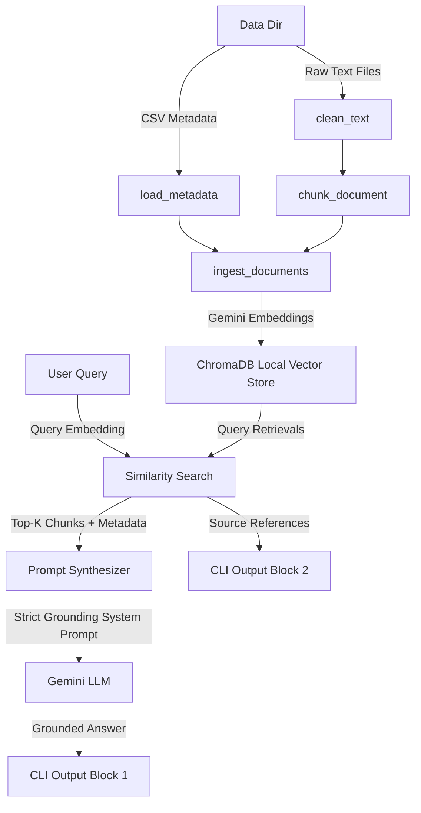

# Local RAG System for AI Governance Documents

This is a clean, production-ready Retrieval-Augmented Generation (RAG) system built in Python 3.10+ for an ML Engineer Assessment. It indexes AI governance documents (the AGORA dataset) and enables grounded question-answering with verifiable source references.

---

##  High-Level Architecture

The system follows a modular, pipeline-based architecture utilizing native Python functions and avoids heavy orchestrators (like LangChain or LlamaIndex) for maximum transparency, control, and performance.



---

##  Key Technical Decisions

### 1. Ingestion & Chunking Strategy (`src/ingest.py`)
- **Word-Boundary Preservation**: Character-based chunking (~800 characters) with a sliding-window overlap of 10% (~80 characters). When splitting text, the algorithm scans backward up to 10% of the chunk size to find a space or newline, preventing word clipping or cutting mid-sentence.
- **Rich Chunk Metadata**: Metadata from `documents.csv` (like `Official name`, `Link to document`, `Authority`, `Collections`) is dynamically matched to text chunks via the file name's ID. This powers grounded citations in downstream queries.
- **Incremental Ingestion**: The system queries ChromaDB before processing text. Any files that are already embedded and stored are skipped, saving API rate limits, costs, and developer time.

### 2. Vector Database Selection
- **ChromaDB (`PersistentClient`)**: Rather than a purely in-memory transient store (which would require re-indexing and re-embedding all 640+ files on every query execution), we utilize ChromaDB's persistent client. The vector database is stored locally in `./chroma_db`, running entirely in-process and avoiding complex client-server setups.

### 3. LLM & Embeddings
- **Official Google GenAI SDK (`google-genai`)**: Replaces legacy libraries with the modern unified Gemini developer SDK.
- **`gemini-embedding-001`**: Generates text embeddings.
- **`gemini-2.5-flash`**: Synthesizes the final grounded answer. Set to `temperature=0.0` to enforce highly deterministic and factual responses.

### 4. Grounding Guardrails (`src/rag.py`)
- The system instructions dictate that the model must base its answer *only* on the retrieved context chunks. If the answer cannot be fully deduced from the context, it outputs exactly: `"I cannot find the answer in the provided documents."`

---

##  Quick Start

### 1. Setup Environment
Clone the repository and install the dependencies:
```bash
pip install -r requirements.txt
```

Set your Gemini API Key. The CLI loads from local environment variables or an optional `.env` file (see `.env.template`):
```bash
# Windows (PowerShell)
$env:GEMINI_API_KEY="your-api-key-here"

# Linux/macOS
export GEMINI_API_KEY="your-api-key-here"
```

### 2. Run Ingestion
To ingest raw text files into ChromaDB. We recommend using `--limit` during testing to index a subset of documents quickly:
```bash
# Ingest only 10 documents
python main.py --ingest --limit 10

# Ingest all 640+ documents
python main.py --ingest
```
*Note: You can also specify `--api-key your-key-here` directly in the command if you do not want to set environment variables.*

### 3. Run RAG Queries
Ask questions grounded on the ingested dataset:
```bash
python main.py --query "What is the CREATE AI Act of 2023?"
```

**Query Output Format:**
```text
======================================================================
                         GROUNDED ANSWER                              
======================================================================
The CREATE AI Act of 2023 establishes the National Artificial Intelligence 
Research Resource (NAIRR) to democratize access to AI resources and spur 
U.S. AI research capacity.
======================================================================

======================================================================
                     EXACT SOURCE REFERENCES                          
======================================================================
1. CREATE AI Act of 2023 [File: 444.txt, Chunk: 0]
   - Authority:   United States Congress
   - Collection:  U.S. federal laws
   - Source Link: https://www.congress.gov/bill/118th-congress/senate-bill/2714
--------------------------------------------------
======================================================================
```

### 4. Run Web Application (Desktop & Mobile)
Launch the local web server to interact with a responsive chat dashboard interface:
```bash
python main.py
```
Open **`http://127.0.0.1:8000`** in your browser.
- Displays database status (pulsing badge showing how many chunks are loaded).
- Model selection options.
- Dynamic conversation bubbles for chat queries.
- Collapsible cards to view exact document sources and official links.

---

##  Verification & Unit Tests
Verify correctness of the code and mock the Gemini API offline:
```bash
python test_rag.py
```

---

##  Engineering Trade-Offs & Future Scalability

### Trade-offs Made
1. **Character-based vs. Semantic Chunking**: character-based sliding-windows with boundary detection are fast, deterministic, and lightweight. Semantic chunking (which groups based on sentence embedding shifts) is superior for cohesive context but would add considerable ingestion latency and API costs.
2. **Local Sqlite-based ChromaDB vs. Distributed Vector Store**: For an assessment or edge deployment, SQLite-backed ChromaDB is ideal. For enterprise-scale applications (e.g. millions of documents), migrating to a client-server distributed database (such as Qdrant, Milvus, or pgvector) is recommended.

### Limitations & Future Scope
- **Rate-Limiting / Quotas**: Large datasets can trigger API limits on the free/standard Gemini tier. Currently, we implement batching and exponential backoff, but a queue-based ingestion worker (using Celery/Redis) would be more robust for production.
- **Hybrid Search**: Combining semantic embedding searches with lexical BM25 keyword searches (hybrid search) significantly improves retrieval relevance for specific legal clauses or section numbers.
- **Dynamic Re-ranking**: Adding a Cross-Encoder Re-ranker (like Cohere or SentenceTransformers) would optimize retrieved contexts before feeding them to the LLM.
